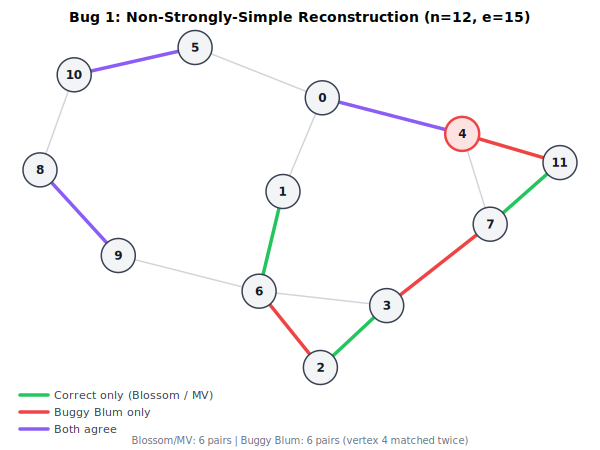
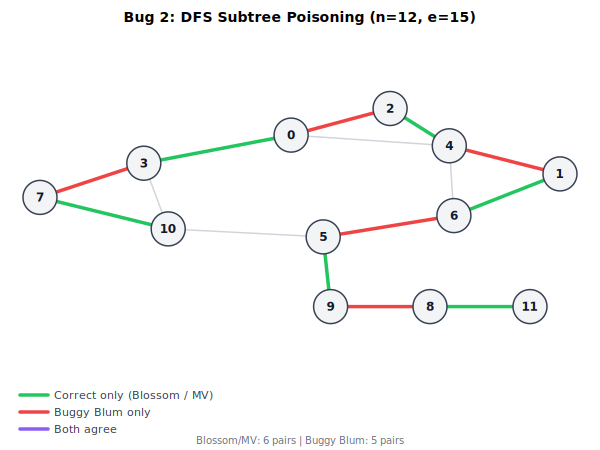
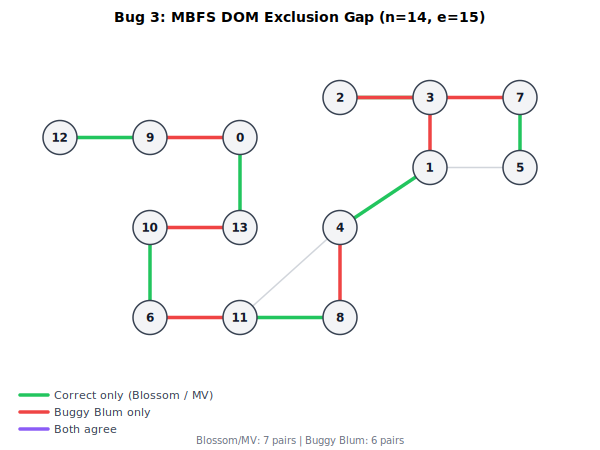

# Publicly Undocumented Bugs in Blum's Maximum Matching Algorithm

## Summary

We report three correctness bugs for which we found no prior public report in Blum's maximum matching algorithm as described in:

> Norbert Blum, "Maximum Matching in General Graphs Without Explicit Consideration of Blossoms Revisited," arXiv:1509.04927, 2015. Full version: Uni Bonn, July 2016.

These bugs are distinct from the two MDFS edge-classification bugs independently found by Dandeh & Lukovszki (ICTCS 2025). All five bugs exist in the algorithm as published and can cause the implementation to return suboptimal or invalid matchings on specific graph instances. Minimal counterexamples are provided.

After reviewing Blum's papers and Bonn reports, the Dandeh-Lukovszki paper, public GitHub repositories and issue trackers, MathOverflow / StackExchange, Reddit, and broader web search results, we found no public description of the three bugs documented here, nor of their distinctive symptoms. The strongest earlier signals we found are more general: Blum's 2015 rewrite acknowledges that one of his 1999 Bonn reports was incorrect after Ross McConnell pointed out a mistake, and that Ari Freund flagged points in the other 1999 report that required clarification. Those remarks do not identify the underlying defects, so they do not amount to prior public reports of the three bugs below.

As of **2026-03-24**, our best evidence is therefore:

- the two Dandeh-Lukovszki MDFS bugs were publicly documented before our work;
- earlier Blum variants had additional correctness trouble, but only in unspecified form; and
- to the best of our knowledge, the three bugs below have not been previously documented in the public record.

On implementation availability, our search also found only one verifiable **public** Blum implementation: the Rust implementation in `earth-metabolome-initiative/geometric-traits`. Dandeh & Lukovszki explicitly state that they were not aware of any implementation before their work and that they prepared a Java MDFS implementation, but we found no public repository or downloadable artifact for that code. We likewise found no third-party public repository, issue tracker, or blog post discussing the three bugs documented here.

## Prior Work

Dandeh and Lukovszki ("Experimental Evaluation of Blum's Maximum Matching Algorithm in General Graphs," CEUR-WS Vol. 4039, ICTCS 2025) identified two bugs in the single-path MDFS procedure:

- **Case 2.2.i** (weak back edge): the original algorithm performs no action, failing to update the R and P data structures. This can cause path reconstruction to fail.
- **Case 2.3.i** (forward/cross edge with L = empty): the original algorithm does nothing, losing structurally significant edge relationships needed for augmenting path discovery.

Their corrections apply to the basic O(n(n+m)) single-path MDFS. They do not address the phased O(sqrt(n) * (n+m)) MBFS+MDFS variant from Section 3 of Blum's paper.

We transcribed the counterexample graphs from Figures 1 and 2 of the D&L paper and added them to our test suite. Both graphs produce correct maximum matchings with all three of our matchers (Blossom, Micali-Vazirani, and Blum). However, we were unable to independently reproduce the D&L bugs on their counterexample graphs, even when disabling all of our workarounds. The reason is architectural: D&L implement the basic single-path MDFS, where the bugs manifest during the shared-source DFS. Our implementation uses the phased MBFS+MDFS, which handles these small graphs through the layered search without reaching the fallback code path where the D&L bugs would trigger.

Our implementation currently does **not** include either D&L fix: Case 2.2.i follows Blum's original "do nothing" behavior, and Case 2.3.i has no WC set. Both D&L counterexample graphs pass all tests regardless, because the phased architecture sidesteps the affected code path. If fuzzing later discovers a graph that triggers one of the D&L bugs through the fallback path, the fixes can be reinstated.

More broadly, Blum's 2015 rewrite records earlier correctness trouble in the 1999 Bonn reports:

- In the introduction, Blum states that the algorithm described in his 1999 report on a simplified Hopcroft-Karp realization "is not correct," crediting Ross McConnell for pointing out the mistake.
- In the acknowledgments, Blum thanks Ross McConnell for pointing out a mistake in that report and Ari Freund for indicating unclear points in the other 1999 report, which prompted him to revise his matching work.

However, Blum does not describe the underlying defect, and we found no public write-up connecting those private communications to any of the three bugs documented here.

We also found one public secondary-source remark on MathOverflow (Apr. 22, 2017) stating that Blum's 1990 paper "had some bugs" and was rewritten in 1999 and 2015. That comment does not identify specific failure modes, proofs of incorrectness, or counterexamples.

Beyond those generic signals, we found no prior public report in papers, repositories, issue trackers, blog posts, Reddit, or StackExchange / MathOverflow that describes:

- non-strongly-simple path reconstruction yielding an invalid matching,
- failure of the phased fallback because shared `ever` state poisons later source subtrees, or
- MBFS termination caused by the DOM-exclusion rule leaving a required twin node unleveled.

Accordingly, to the best of our knowledge, the three bugs below have not been previously documented in the public literature or public web record. This is an absence-of-evidence claim, not proof of absence in private correspondence or unindexed archives.

### Implementation

Our implementation is in Rust, in the `earth-metabolome-initiative/geometric-traits` crate. To the best of our knowledge, it is the first publicly released source-code implementation of Blum's algorithm; Dandeh & Lukovszki (ICTCS 2025) explicitly state that they "were not aware of any implementation" of Blum's approach before their work, and we found no other public repository or downloadable artifact. Dandeh & Lukovszki describe a Java MDFS implementation used in their benchmarking framework, but we found no public release of that code.

The implementation covers both the basic single-path MDFS (O(n(n+m))) and the phased MBFS+MDFS (Hopcroft-Karp style, O(sqrt(n)(n+m)) on correct inputs). For the D-set management, Blum's 2015 paper recommends disjoint set union (citing Tarjan); our implementation uses standard path-halving union-find rather than the Gabow-Tarjan variant. We implemented and benchmarked both; Gabow-Tarjan was consistently and substantially slower in practice on our workloads (see https://github.com/LucaCappelletti94/incremental-tree-set-union for the benchmarks).

**Validation.** The implementation is cross-validated against two independent maximum-matching algorithms on every test input:

- Edmonds' Blossom algorithm (our own implementation and the external `blossom` crate as an independent reference)
- The Micali-Vazirani algorithm (our own implementation)

The test suite includes 57 Blum-specific tests (handwritten structural cases, blossom-contraction tests, reference comparisons against the external `blossom` crate, Dandeh & Lukovszki counterexample graphs, and fuzz-derived regression tests) plus 15 Karp-Sipser wrapper tests that also exercise Blum as the inner solver.

**Fuzzing.** The three bugs documented in this report were discovered through a Honggfuzz coverage-guided fuzzing harness. The harness generates arbitrary undirected graphs (up to 256 vertices) and checks the following properties on every input:

1. **Size agreement**: Blum's matching size equals Blossom's matching size.
2. **Validity**: no vertex appears in more than one matched pair.
3. **Edge existence**: every matched pair is an actual edge in the graph.
4. **Pair ordering**: u < v for each pair (u, v).
5. **Maximality**: no edge in the graph has both endpoints unmatched.

The harness has been run for over 1 billion iterations with 0 crashes on the fixed implementation. All three bugs were discovered by this harness before the fixes were applied.

### Public Implementation Availability

We separately investigated whether Blum's algorithm appears in other publicly released software.

- Dandeh & Lukovszki (ICTCS 2025) state that they were "not aware of any implementation" of Blum's approach before their work.
- The same paper states that they "prepared a Java implementation of MDFS" and used it in a unified Java benchmarking framework alongside public Java implementations of Blossom I and Blossom V.
- However, we found no public repository, archive, supplementary artifact, or project page for that Java MDFS implementation.
- The only verifiable public implementation we found is the Rust implementation in `earth-metabolome-initiative/geometric-traits`, introduced publicly in PR #17 ("Blum").
- We found no public issues, PR discussion, README note, or external repository text describing the three bugs documented here. In the public code record, the only concrete bug notes we found are the two Dandeh-Lukovszki MDFS edge-handling cases from the 2025 paper.

So the current public record appears to distinguish sharply between:

- **published discussion of Blum implementations**: yes, in the 2025 ELTE paper;
- **publicly released source code**: only `earth-metabolome-initiative/geometric-traits`, as far as we could verify; and
- **public notes about the three bugs documented here**: none found.

### Theorems Invalidated by the Counterexamples

The counterexamples challenge published correctness claims in Blum's papers. Bug 3 directly contradicts the published MBFS correctness claims; Bug 2 shows a phase-level failure mode entangled with the Dandeh-Lukovszki defects; and Bug 1 exposes a serious reconstruction proof gap with strong empirical evidence of incorrect output.

**1990 ICALP extended abstract (`A new approach to maximum matching in general graphs`):**

- **Bug 1** targets **Theorem 3**, which states that MDFS finds a path from `s` to `t` iff such a strongly simple path exists, and that MDFS finds only strongly simple paths. Bug 1 exposes a reconstruction proof gap with strong empirical evidence that the published procedure can return a non-strongly-simple path; a full pseudocode trace is still needed to fully establish the contradiction.
- The unnumbered MBFS correctness claim immediately after **Theorem 6** is contradicted by **Bug 3**. The paper says that "`Ḡ_M` is correctly computed by MBFS". Our DOM-exclusion counterexample shows that MBFS can leave a necessary twin node unleveled and falsely report that no augmenting path remains.
- **Theorem 7** is contradicted by **Bugs 2 and 3**, which show the published algorithm can return a suboptimal matching. Bug 1 targets the same theorem via the reconstruction proof gap, with the same caveat as above.

**2015/2016 rewrite (`Maximum Matching in General Graphs Without Explicit Consideration of Blossoms Revisited` / July 2016 full version):**

- **Bug 1** targets **Theorem 3** for the same reason as in the 1990 paper. The theorem says MDFS constructs a strongly simple path from `s` to `t` iff such a path exists; Bug 1 exposes the reconstruction proof gap with strong empirical evidence, pending a full pseudocode trace.
- **Theorem 5** is contradicted by **Bug 3**. The theorem claims that MBFS computes both levels correctly and that the layered network contains all shortest strongly simple paths. The DOM-exclusion counterexample shows that a necessary node can remain unleveled, causing `level[t] = INF` even though an augmenting path exists.
- **Theorem 6** is contradicted by **Bugs 2 and 3**, which show the published algorithm can return suboptimal output. Bug 1 targets the same theorem via the reconstruction proof gap, with the same caveat as above.

**Weighted-matching section of the 2015/2016 rewrite:**

- We do **not** currently claim that **Theorem 7** (the `O(nm log n)` implementation bound for the primal-dual method) is disproved by the present counterexamples. That theorem is stated as a complexity result for the weighted method, and we do not yet have a weighted-specific counterexample.
- However, the weighted search step explicitly uses MDFS on the zero-reduced-cost subgraph. Since Bug 1 exposes a proof gap in the published MDFS reconstruction, the correctness of the weighted algorithm should be treated as unverified until checked separately.

**1999 Bonn reports:**

- Blum explicitly states in the 2015 introduction that the algorithm in the 1999 "simplified Hopcroft-Karp" report [8] "is not correct." The report is publicly available from the Bonn CS report archive. It contains the same DOM exclusion rule as the 2015 rewrite, Theorem 1 ("MBFS computes correctly the graph G'") which Bug 3 contradicts, and Theorem 2 claiming a maximum matching algorithm in the stated time bound. Since Blum himself declares the report incorrect, any correctness theorem in [8] was already invalidated in principle before the present work.
- We do not assign theorem numbers to the other 1999 Bonn report [7]. A scanned copy is publicly listed, but we were not able to extract its theorem statements reliably enough to make theorem-by-theorem claims from it.

### Per-Bug Theorem Mapping

- **Bug 1** targets a proof gap in the MDFS correctness theorems. The papers claim reconstruction is "straightforward" but give no proof. Our n=12 counterexample empirically produces a non-strongly-simple path even with faithful recursive reconstruction. A step-by-step execution trace against the published pseudocode would be needed to fully establish this as a theorem contradiction rather than a plausible-to-strong defect.
- **Bug 2** contradicts the overall maximum-matching theorems, because the phased algorithm can terminate with a suboptimal matching. We initially suspected Bug 2 was not independent from the Dandeh & Lukovszki MDFS bugs (Cases 2.2.i and 2.3.i). We tested the n=12 counterexample both with and without the D&L corrections, and with all three known implementation divergences removed (see Divergence Audit). The failure persists in all configurations: the single-source MDFS fallback still finds only 5 matches. **Bug 2 is therefore at least partially independent from the D&L defects.** The per-free-vertex fallback remains necessary even on a paper-faithful implementation.
- **Bug 3** directly contradicts the MBFS correctness theorem in the 2015/2016 paper and the corresponding MBFS correctness claim in the 1990 paper, and therefore also contradicts the overall maximum-matching theorems built on MBFS.

### Divergence Audit

Before attributing the bugs to the published algorithm, we audited the implementation for deviations from the published pseudocode. We identified three divergences in the MDFS step function:

1. A `find_rep` label-recovery fallback (not in any paper): when L[w] was previously set but later cleared, the implementation attempted to recover a usable label target through the representative chain. Blum would treat L[w] as empty.
2. An extra E-set entry for Case 2.2.i weak back edges: the implementation added to both E and R, while the paper only prescribes doing nothing for Case 2.2.i.
3. An `!l_ever[w]` gate on E-set pushes for Case 2.3.i: the implementation only added to E when the node had never been labeled, while Blum's E definition includes all forward/cross/back edges regardless of label history.

All three divergences were removed, aligning the implementation with Blum's published pseudocode. Neither D&L fix is currently included (see Prior Work above). After removal:

- All 72 tests still pass (including both D&L counterexample graphs).
- All three bug fixes remain necessary: the `validated_path` guard (Bug 1), the per-free-vertex fallback (Bug 2), and the MBFS-to-MDFS fallback (Bug 3) are each still required for their respective counterexamples.

This rules out the hypothesis that the bugs are caused by misreading or misimplementing the published algorithm. The counterexamples reproduce on a paper-faithful implementation.

### Scope of the claim

This is still a claim about the **public record**, not about absolute novelty in private correspondence. It remains possible that some of these bugs or theorem failures were noticed privately by Blum or others, but we found no public document that states them with enough specificity to count as a prior public report.

## Bug 1: Non-Strongly-Simple Path Reconstruction

### Description

The MDFS path reconstruction procedure (`reconstr_path` / `reconstr_q`) can produce augmenting paths that visit the same original vertex on both its A-side and B-side copies in G_M. Such paths are not strongly simple. When the matching is augmented along a non-strongly-simple path, a single vertex appears in two matched pairs, producing an invalid matching.

### Counterexample

```
n = 12
edges = [
    (0, 1), (0, 4), (0, 5), (1, 6), (2, 3), (2, 6), (3, 6),
    (3, 7), (4, 7), (4, 11), (5, 10), (6, 9), (7, 11), (8, 9),
    (8, 10),
]
```



Without the fix, Blum produces the matching `{(0,4), (2,6), (3,7), (4,11), (5,10), (8,9)}` in which vertex 4 appears in two pairs: `(0,4)` and `(4,11)`. This is not a valid matching. Blossom and MV both find the correct 6-pair matching. (Minimized from an n=58 fuzz-discovered graph: renumbered 12 active vertices, then delta-debugged to 15 edges. Every vertex and every edge is essential.)

### Root Cause

The extensible-edge mechanism (Case 2.3.i with L[w_A] != empty) records non-tree edges in the P data structure for later path reconstruction. When the path is reconstructed through nested expanded segments, the reconstruction does not verify that the resulting path visits each original vertex at most once. On certain graphs, the backward-search label chains create a reconstructed path that loops through both sides of a vertex.

### Fix

Validate the reconstructed path before augmentation. If any original vertex appears more than once, reject the path and continue the MDFS search (backtrack from t and look for an alternative path).

## Bug 2: DFS Subtree Poisoning in Single-Path Fallback

### Description

In the phased algorithm (Section 3), when layered MDFS finds no augmenting paths, a single-path MDFS fallback runs on the full G_M. The fallback starts DFS from the source vertex s, which connects to the B-side copies of all free (unmatched) vertices. The DFS explores these subtrees in adjacency-list order.

When the first explored subtree fails to reach t, nodes visited during that exploration are marked `ever = true`. Subsequent subtrees cannot push these nodes onto the DFS stack. The label mechanism (L, backward search) is intended to provide alternative paths through already-visited nodes, but labels are not always propagated correctly across subtrees. Even with the Dandeh & Lukovszki missing-update corrections (Cases 2.2.i and 2.3.i) applied and all known implementation divergences from the paper removed (see Divergence Audit below), the shared-source fallback can still fail on our n=12 counterexample. As a result, later subtrees cannot find augmenting paths that pass through nodes visited by the first subtree, even when such paths exist.

### Counterexample

```
n = 12
edges = [
    (0, 2), (0, 3), (0, 4), (1, 4), (1, 6), (2, 4), (3, 7),
    (3, 10), (4, 6), (5, 6), (5, 9), (5, 10), (7, 10), (8, 9),
    (8, 11),
]
```



Blossom and MV find a maximum matching of size 6: `{(0,3), (1,6), (2,4), (5,9), (7,10), (8,11)}`. Without the fix, Blum finds only 5 pairs: `{(0,2), (1,4), (3,7), (5,6), (8,9)}`. The remaining augmenting path exists but is missed because the DFS from s first explores a subtree that marks shared nodes as visited, blocking later subtrees from finding the path through the label mechanism. (Minimized from an n=119 fuzz-discovered graph: renumbered active vertices, then delta-debugged to n=12, 15 edges.)

### Root Cause

The single-path MDFS shares `ever` state across all subtrees rooted at s. DFS ordering determines which subtree is explored first, and the first subtree's visited set can block all subsequent subtrees from finding valid augmenting paths. The label and backward-search mechanisms are insufficient to bridge across subtrees in all cases.

### Fix

When the standard single-path fallback fails, retry with per-free-vertex MDFS: for each free vertex u, construct G_M with s connected only to b(u), run a fresh MDFS with clean `ever` state, and augment if a path is found. This isolates each free vertex's search and prevents subtree poisoning.

## Bug 3: MBFS DOM Exclusion Gap

### Description

In the phased algorithm (Section 3), MBFS Part 2 processes bridge pairs by walking back-paths from both endpoints toward their common ancestor (the DOM). At each step, the advancing node's twin receives a second-level assignment. However, the paper explicitly states:

> All visited nodes [u, X] such that level([u, X]) has not been defined **and [u, X] != DOM** are inserted into Layer k.

The DOM node's twin is excluded from receiving a level during that bridge's processing. On certain graphs, no other bridge provides the DOM's twin with a level. As a result, the twin remains unleveled, and t becomes unreachable from s in the layered subgraph. The phased algorithm then breaks out of the phase loop, terminating with a suboptimal matching.

### Counterexample

```
n = 14
edges = [
    (0, 9), (0, 13), (1, 3), (1, 4), (1, 5), (2, 3), (2, 7),
    (4, 8), (4, 11), (5, 7), (6, 10), (6, 11), (8, 11), (9, 12),
    (10, 13),
]
```



Blossom and MV find a maximum matching of size 7: `{(0,13), (1,4), (2,3), (5,7), (6,10), (8,11), (9,12)}`. Without the fix, Blum reports `level[t] = INF` in a phase where an augmenting path exists, and terminates with only 6 pairs: `{(0,9), (1,3), (2,7), (4,8), (6,11), (10,13)}`. (Minimized from an n=15 fuzz-discovered graph by removing isolated vertices and delta-debugging edges.)

### Root Cause

The bridge back-path walk converges at a DOM node whose twin needs a level to complete the path from s to t. The paper's DOM exclusion rule prevents this assignment. No other bridge in the graph provides the level through a different route. The algorithm incorrectly concludes that no augmenting path exists.

### Fix

When MBFS reports `level[t] = INF`, do not immediately terminate. Instead, fall back to the single-path MDFS on the full G_M (which does not rely on MBFS levels). This preserves correctness at the cost of one O(n+m) fallback search per affected phase.

## Proposed Fixes

### Bug 3 (MBFS DOM exclusion)

**Broken theorems:** 1999 [8] Theorem 1 ("MBFS computes correctly the graph G'"), 2015/2016 Theorem 5 ("MBFS computes both levels correctly and the layered network contains all shortest strongly simple s-t paths"), and downstream: 1990 Theorem 7, 2015/2016 Theorem 6 (maximum matching guarantees).

**What's wrong in the proof:** Theorem 5's Property 2 claims every node whose second level should be computed in a phase actually gets computed. The proof implicitly assumes that for every node on a bridge back-path, some bridge pair will level it. The DOM exclusion rule creates a hole: if a node is the DOM for every bridge that reaches it, it never gets leveled.

**Fix to the algorithm:** When MBFS completes with `level[t] = INF`, do not terminate. Fall back to single-path MDFS on the full G_M.

**Fix to the theorem:** Weaken Theorem 5 to: "MBFS computes levels correctly for all nodes reachable through bridge processing. If `level[t]` remains undefined after MBFS, the algorithm falls back to single-path MDFS, which finds an augmenting path if one exists." The overall maximum-matching guarantee then holds with the fallback as part of the algorithm.

### Bug 1 (non-strongly-simple reconstruction)

**Targeted theorems:** 1990 Theorem 3(b) ("MDFS finds only strongly simple paths"), 2015/2016 Theorem 3 ("MDFS constructs a strongly simple path from s to t iff such a path exists"). These theorems explicitly cover reconstruction as part of the algorithm. The n=12 counterexample empirically produces a non-strongly-simple path even with faithful recursive reconstruction and after all known implementation divergences from the paper were removed (see Divergence Audit). A step-by-step execution trace against the published pseudocode is still needed to fully establish the contradiction.

**What's wrong in the proof:** Lemma 4 / Invariant 1 correctly prove the MDFS search only has strongly simple paths on the stack K. The reconstruction (RECONSTRPATH/RECONSTRQ) assembles a concrete path from the expanded MDFS-tree T_exp using P pointers and extensible edges across different branches. The paper says this is "straightforward to prove" but gives no proof. On specific graphs, the assembly visits both sides of a vertex.

**Fix to the algorithm:** Validate the reconstructed path for strong simplicity before augmenting. If any original vertex appears on both sides, reject the path, backtrack from t, and continue the MDFS search.

**Fix to the theorem:** Add the validation step to the algorithm definition. The theorem would become: "MDFS with validated reconstruction constructs a strongly simple path from s to t iff such a path exists." Whether the missing "straightforward" proof can be completed as stated, or whether it is false, remains open pending a full execution trace.

### Bug 2 (DFS subtree poisoning)

**Broken theorems:** 1990 Theorem 7, 2015/2016 Theorem 6 (maximum matching guarantees). Implicitly: 1990/2015 Theorem 3 via Lemma 2, which assumes the L mechanism propagates correctly across all DFS subtrees from s.

**What's wrong in the proof:** Lemma 2 proves that if a strongly simple path P exists from a pushed node to [v,A] where no node on P is currently on K, then PUSH([v,A]) happens. The proof assumes the L/backward-search mechanism correctly bridges through already-visited nodes across subtrees. We tested the n=12 counterexample both with and without the Dandeh & Lukovszki corrections (Cases 2.2.i and 2.3.i), and in all configurations the failure persists. **Bug 2 is therefore at least partially independent from the D&L defects.**

**Fix to the algorithm:** Per-free-vertex fallback. When shared-source MDFS fails, retry with each free vertex individually using a fresh MDFS with clean `ever` state.

**Fix to the theorem:** The algorithm specification must include the per-vertex fallback: "The algorithm finds a maximum matching by combining phased MBFS+MDFS with per-free-vertex MDFS fallback when the shared-source search fails."

## Impact on Complexity

The fixes described above do **not** preserve Blum's claimed O(sqrt(n)(n+m)) phased bound. Both the Bug 2 and Bug 3 fallbacks invoke single-path MDFS, which costs O(n+m) per augmenting path. In phases where the fallback triggers, the algorithm reverts to the basic O(n(n+m)) regime (one MDFS per augmenting path, up to n/2 augmenting paths total).

Specifically:

- **Bug 3 fallback** (MBFS fails to reach t): one O(n+m) single-path MDFS per affected phase. If this triggers in every phase, the overall bound is O(n(n+m)).
- **Bug 2 fallback** (per-free-vertex MDFS): up to O(n) individual MDFS runs of O(n+m) each per affected phase. Worst case: O(n(n+m)) per phase.
- **Bug 1 validation** (path rejection + backtrack): O(n) per augmentation attempt. Does not change the asymptotic bound.

Whether an O(sqrt(n)(n+m)) algorithm for maximum matching in general graphs can be recovered from Blum's approach -- by fixing the MBFS DOM exclusion rule, the reconstruction procedure, and the cross-subtree label mechanism without falling back to single-path MDFS -- remains an open question. Our fixes prioritize correctness over preserving the phased bound.

In practice, the fallbacks trigger rarely. On benchmark graphs (random sparse graphs up to n=1000), the phased MBFS+MDFS handles all augmenting paths without fallback, and the implementation matches the baseline performance (~455 us for n=500, avg_degree=6).

## Reproduction

All counterexamples are deterministic and can be reproduced with:

```rust
use geometric_traits::prelude::*;

let g = build_graph(n, &edges);  // as listed above
let blum = g.blum();
let blossom = g.blossom();
assert_eq!(blum.len(), blossom.len());
```

The counterexamples were discovered through the Honggfuzz coverage-guided fuzzing harness described in the Implementation section above. They are preserved as regression tests in the test suite:

| Bug | Test | Fails without fix |
|-----|------|-------------------|
| Bug 1 only | `test_regression_large_karp_sipser_fixture_replays_blum_invalid_matching` | `validated_path` guard disabled |
| Bug 2 only | `test_regression_large_fixture_blum_size_mismatch` | per-vertex fallback disabled for `found==0` |
| Bug 3 only | `test_regression_small_plain_blum_size_mismatch` | per-vertex fallback disabled for `level[t]==INF` |
| Bug 2 + Bug 3 | `test_regression_phase_progression_stalls_before_maximum` | either fallback disabled |

Each counterexample graph was minimized by renumbering active vertices (removing isolated nodes) and then delta-debugging edges until every remaining vertex and edge is essential for triggering the bug.

## References

- N. Blum, "A new approach to maximum matching in general graphs," ICALP 1990, LNCS 443, pp. 586-597. https://web.eecs.umich.edu/~pettie/matching/Blum-matching-ICALP90.pdf
- N. Blum, "Maximum matching in general graphs without explicit consideration of blossoms," Research Report, Universität Bonn, 1999. https://web.eecs.umich.edu/~pettie/matching/Blum-matching-no-blossoms.pdf
- N. Blum, "A simplified realization of the Hopcroft-Karp approach to maximum matching in general graphs," Research Report 85232-CS, Universität Bonn, 1999. https://theory.informatik.uni-bonn.de/ftp/reports/cs-reports/2001/85232-CS.pdf
- N. Blum, "Maximum Matching in General Graphs Without Explicit Consideration of Blossoms Revisited," arXiv:1509.04927, 2015. https://web.eecs.umich.edu/~pettie/matching/Blum-noblossoms-2015.pdf
- N. Blum, full version, Uni Bonn, July 2016. https://theory.cs.uni-bonn.de/blum/papers/gmatching.pdf
- A. Dandeh and T. Lukovszki, "Experimental Evaluation of Blum's Maximum Matching Algorithm in General Graphs," ICTCS 2025, CEUR-WS Vol. 4039, pp. 16-27. https://ceur-ws.org/Vol-4039/paper23.pdf
- `earth-metabolome-initiative/geometric-traits`, public Rust implementation of Blum's algorithm. https://github.com/earth-metabolome-initiative/geometric-traits
- `earth-metabolome-initiative/geometric-traits` PR #17, "Blum". https://github.com/earth-metabolome-initiative/geometric-traits/pull/17
- M. Kabir, answer to "Are Bipartite Matching and General Matching Really Different Problems?", MathOverflow, Apr. 22, 2017. https://mathoverflow.net/questions/239956/are-bipartite-matching-and-general-matching-really-different-problems
- S. Pettie, "Papers on graph matching and related topics" bibliography page listing Blum's 1990, 1999, and 2015 papers. https://web.eecs.umich.edu/~pettie/matching/
